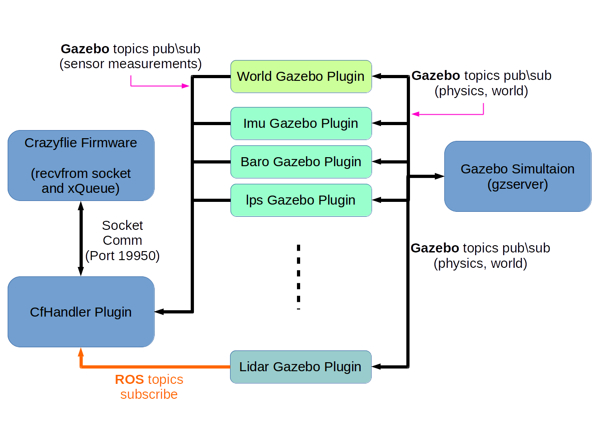

# Crazyflie SITL


## General Background

### Gazebo communication between processes:

The communication library currently uses the open source `Google Protobuf` for the message serialization and `boost::ASIO` (asynchronous io) for the transport mechanism. It supports the publish/subscribe communication paradigm.

more at: [http://gazebosim.org](http://gazebosim.org/tutorials?tut=architecture&cat=get_started):

**Boost::ASIO** ([https://www.boost.org](https://www.boost.org/doc/libs/1_66_0/doc/html/boost_asio.html)):

Boost.Asio is a cross-platform C++ library for network and low-level I/O programming that provides developers with a consistent asynchronous model using a modern C++ approach.


### Gazebo plugin:

[gazebo plugin](http://gazebosim.org/tutorials/?tut=plugins_hello_world) : A plugin is a chunk of code that is compiled as a shared library and inserted into the simulation. The plugin has direct access to all the functionality of Gazebo through the standard C++ classes.

<u>Tip:</u> search you directory for plugins:

`grep -rnI '<wanted\search\directory>' -e 'plugin name='`

in catkin:


#### Incorporation MR18 in crazyflie SITL simulation (sim_cf)

**sim_cf general background:**

The `sim_cf` enables crazyflie firmware SITL test with gazebo simulation. It contains a **gazebo model** of the crazyflie, a **cfHandler plugin** and a version of **crazyflie-firmware** which modified for SITL. In the modified FW version, hardware interfaces are modified to gazebo ones (imu, barometer, magnetometer and lps) or disabled (e.g. on board leds).




##### The gazebo cfHandler plugin:

The plugin takes care of the following:

1. Data flow from gazebo simulation to the cf firmware process (e.g sensor measurements). 
2. Data flow from cf firmware process to the gazebo simulation (e.g. engine commands). 
3. Maybe more ...

##### Elaboration on #1 (gazebo --> firmware):

**From gazebo to cfHandler:**

All sensors that are used in the SITL are from gazebo messages. Therefore, the cfHandler uses gazebo transport to subscribe to gazebo sensor topics:

```c++
imu_sub_[index] = node_handle_->Subscribe(cf_prefix + std::to_string(index+first_index) + "/" + imu_sub_topic_, &GazeboCfHandler::ImuCallback_1 , this);
```

<u>Note:</u> this evokes the callback function `ImuCallback_1` each time a message with the gazebo message with the imu topic arrives.

<u>Note:</u> node_handle_ is of type 

`gazebo::transport::NodePtr gazebo::GazeboCfHandler::node_handle_`

**From cfHandler to firmware:**

Stages:

1. Internal (inside plugin) **producer-consumer queue** (sensors from gazebo\ros to firmware):

   https://github.com/cameron314/readerwriterqueue 

   Each sensor enqueues its data into a ("wait for send") queue. 

2. A **sender thread** consumes data from the queue (using wait_dequeue) and sends the data through a **socket** using `sendto` (implemented in `/usr/include/x86_64-linux-gnu/sys/socket.h`)


##### The needed changes:

Add a subscriber to a ROS topic of MR18. Added at the end of Load function (typical function for plugins):

```c++
if (!ros::isInitialized())
	{
	int argc = 0;
	char **argv = NULL;
	ros::init(argc, argv, "gazebo_client",
		ros::init_options::NoSigintHandler);
	}

	// Create our ROS node. This acts in a similar manner to
	// the Gazebo node
	this->rosNode.reset(new ros::NodeHandle("gazebo_client"));

	// Create a named topic, and subscribe to it.
	ros::SubscribeOptions so =
	ros::SubscribeOptions::create<sensor_msgs::LaserScan>(
		"/cf1/cf_tof_ranges",
		1,
		boost::bind(&GazeboCfHandler::OnRosMsg, this, _1),
		ros::VoidPtr(), &this->rosQueue);
	this->rosSub = this->rosNode->subscribe(so);

	// Spin up the queue helper thread.
	this->rosQueueThread =
	std::thread(std::bind(&GazeboCfHandler::QueueThread, this));
```

OnRosMsg:

```c++

void GazeboCfHandler::OnRosMsg(const sensor_msgs::LaserScan::ConstPtr &_msg)
{
	mr18_s m_mr18_info= {
	.header = crtp(CRTP_PORT_SETPOINT_SIM, 0),
	.type = SENSOR_MR18_SIM,
	.ranges = {0}};

	for (int i=0; i<MAX_SENSORS_NUMBER_FOR_LASER_SCAN; i++)
		m_mr18_info.ranges[i] = (uint16_t)(_msg->ranges[i]*1000); 
	
	SensorsData msg;
	msg.index = 0;  // index;
	memcpy(msg.data , (const uint8_t*) &m_mr18_info , sizeof(m_mr18_info));
	if(_isDataReceived) // PATCH : connection with SITL has established (socket is up?)
	{
		//std::cout << "onRosMsg :: enqueue msg" << std::endl;
		m_queueSend.enqueue(msg);
	}	
}
```

Bug was (gazebo topics wait for initialization to occur - socket is up?) before writing to it.


## Connecting GDB


#### Setup:

1. In ***CMakeLists.txt*** add the following:

   ```cmake
   set(CMAKE_CXX_FLAGS_DEBUG "${CMAKE_CXX_FLAGS_DEBUG} -Wall")
   ```

2. Obtain the process id (necessary for **gdb**). Place the following lines in your desired file for debugging (in my project was `gazebo_cfHandler_plugin.h`):

   ```cpp
   #include <unistd.h>
   ...
   ...
       
   std::cout << "getpid=" << getpid() << std::endl;
   ```

2. Launch your program (mine was `roslaunch ....`).

3. In a new terminal the run the **GDB** using the following line (substitute your pid):

   ```bash
   gdb --pid <your_pid>
   ```


**<u>Note:</u>** When running inside **docker**, add the following flags to the `docker run`  command:

```bash
--cap-add=SYS_PTRACE --security-opt seccomp=unconfined
```


#### Bebugging Flow (using cli)

Once inside GDB use the following commands:

* To add breakpoint:

   ```bash
   (pdb) break full/path/to/file.cpp:<line number to break on>
   ```
   
* Display text after breaking:

   ```bash
   (pdb) list
   ```
   
* Continue to next breakpoint

   ```bash
   (pdb) cont
   ```
   
* Step one line:

   ```bash
   (pdb) n
   ```
   
* Print a backtrace of the entire stack:

   ```bash
   (pdb) backtrace
   ```
   
* print variables:

   ```bash
   (pdb) print <var name>
   ```
   
* Reassign variables:

   ```bash
   (pdb) set <var_name>=3
   ```

   

## Changes to firmware

### sensors_sim.h\c instead:

The above fies are used for implementing alternateve implementation `"SENSOR_INCLUDED_SIM"`
This implementation includes the simulation implementation of the sensors:
```c
static const sensorsImplementation_t sensorImplementations[SensorImplementation_COUNT]= {
   {
    .implements = SensorImplementation_sim,
    .init = sensorsSimInit,
    .test = sensorsSimTest,
    .areCalibrated = sensorsSimAreCalibrated,
    .manufacturingTest = sensorsSimManufacturingTest,
    .acquire = sensorsSimAcquire,
    .waitDataReady = sensorsSimWaitDataReady,
    .readGyro = sensorsSimReadGyro,
    .readAcc = sensorsSimReadAcc,
    .readMag = sensorsSimReadMag,
    .readBaro = sensorsSimReadBaro,
    .readMr18 = sensorsSimReadMr18,
    .setAccMode = sensorsSimSetAccMode,
    .dataAvailableCallback = nullFunction,
   },
}
```
for example, the implementation of read gyro:
```c
bool sensorsSimReadGyro(Axis3f *gyro)
{
  return (pdTRUE == xQueueReceive(gyroDataQueue, gyro, 0));
}
```

More changes made to the firmware can easily be found when searching for the `SITL_CF2` macro used throughout the code. 
e.g :
```c
#ifndef SITL_CF2
  #include "nrf24l01.h"
  #include "trace.h"
#endif
```

